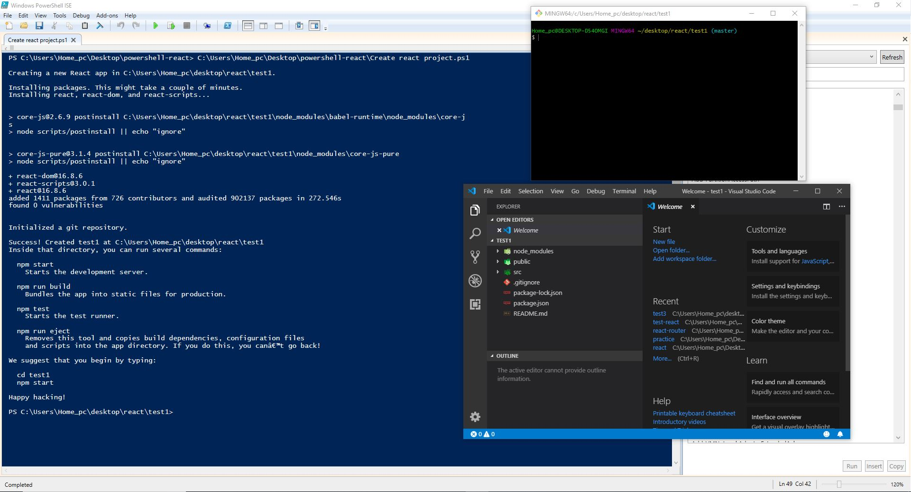

# powershell-react
I create this script because I feel that setting up react app projects for learning or testing is boring.
This script is created by using powershell, so it will be used in window only.

### What you have to edit in the script file

$dir : is the path that you want to set up react apps in

$reactAppName : you can change to the name you want. the name of react apps will be auto generated by concatenating a number with your setting name. For example, the first project that you use this script to generate will be test1. Then, the later projects will be test2, test3, test4 and so on.

### Requirement to run this script

Window 10 

visual studio code 

git-scm

Node.js

